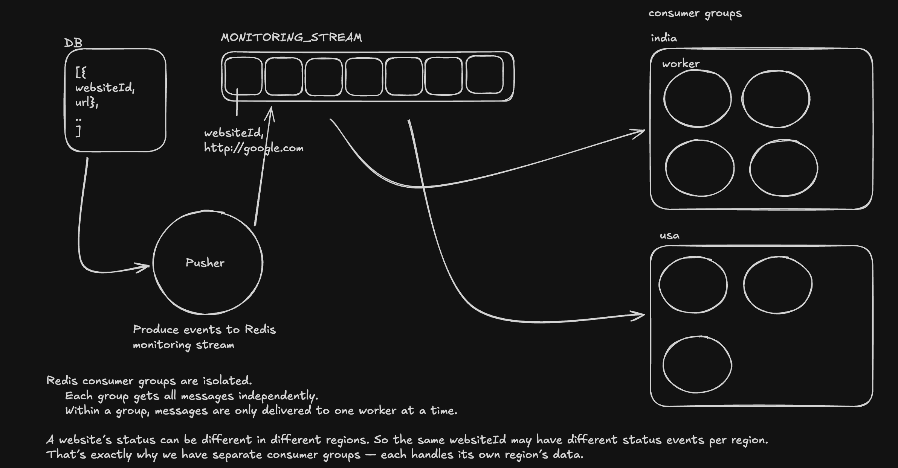
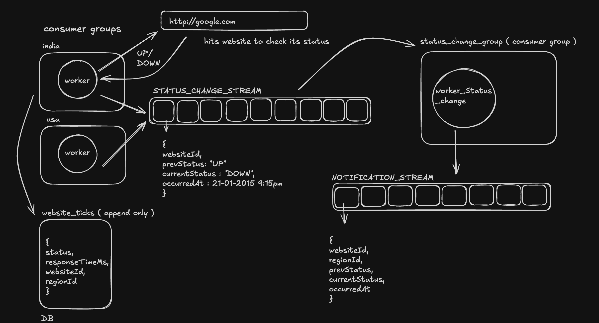
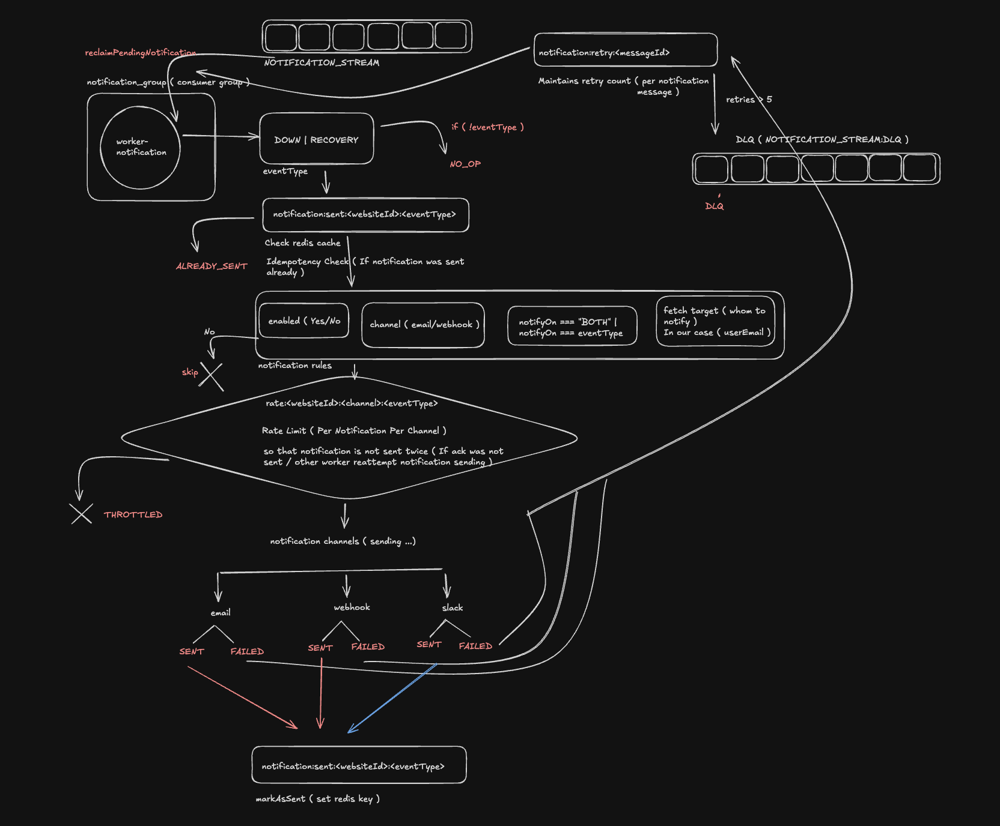
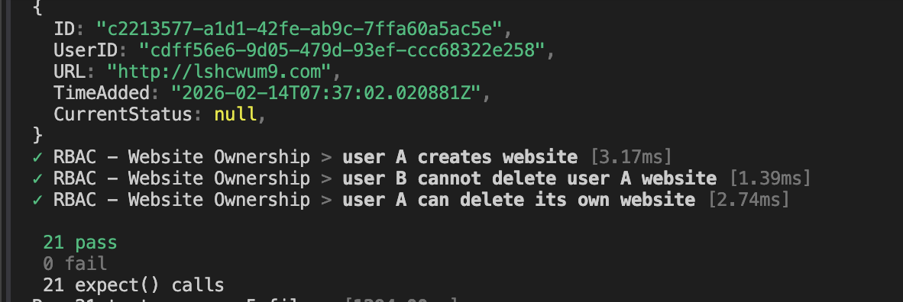

# RunState

**A BetterUptime-inspired uptime monitoring platform built, tested, and re-implemented in Go as a production-style backend system.**

RunState is a monitoring system that periodically checks websites, records uptime and response-time history, tracks incidents, and stores notification events. I first built and fully tested the system in TypeScript, then rewrote the backend in Go to deepen my backend engineering skills by re-implementing a real, end-to-end product.





---

## What it is

RunState is an uptime monitoring platform inspired by BetterUptime.

It supports:

- website monitoring at regular intervals,
- historical check and response-time storage,
- incident tracking when status changes occur,
- notification event persistence,
- API access for dashboard and frontend use,
- containerized local execution,
- Kubernetes deployment through a separate GitOps repository.

This project is not just an architecture write-up. It is implemented, tested, containerized, and prepared for deployment as a production-style backend system.

---

## Core highlights

- **Go backend** with layered architecture
- **Worker-based monitoring pipeline**
- **Redis-backed event flow**
- **Postgres persistence**
- **JWT + refresh-token authentication**
- **Prometheus metrics**
- **Dockerized services**
- **GitHub Actions CI**
- **Frontend-facing monitoring APIs**
- **Deployed through Kubernetes + GitOps**

---

## Architecture

RunState is split into multiple components:

- **API server**  
  Handles authentication, website management, and frontend-facing APIs.

- **monitoring-pusher**  
  Periodically pushes websites into the monitoring pipeline.

- **worker-monitoring**  
  Executes website checks and stores monitoring results.

- **worker-status-change**  
  Detects transitions such as `up -> down` and creates incident and status-change events.

- **worker-notification**  
  Processes notification events and stores notification history.

- **Redis**  
  Connects the workers through an event-driven pipeline.

- **Postgres**  
  Stores users, websites, checks, response times, incidents, and notification logs.

- **GitOps repo**  
  Kubernetes deployment state is managed in [`runstate-gitops`](https://github.com/RitikaxG/runstate-gitops).

---

## Key features

- Authentication with JWT and refresh tokens
- Add, list, and delete monitored websites
- Periodic uptime checks
- Check history and response-time history
- Incident tracking
- Notification logs
- Health and metrics endpoints
- Dockerized multi-service execution
- Kubernetes-ready backend image

---

## Proof of implementation

### Test suite

The repository includes tests under `apps/tests`, and the test suite has been executed successfully.  
This provides proof that the implemented backend behavior has been validated beyond just code structure.



---

## Repo structure

```txt
runState/
├── apps/
│   ├── api-go/        # Go backend, workers, migrations
│   ├── tests/         # Executed test suite
│   └── web/           # Frontend
├── docs/
│   ├── architecture/  # Architecture diagrams
│   ├── devops/        # Deployment and infra notes
│   ├── workers/       # Worker flow documentation
│   └── screenshots/   # Proof-of-implementation screenshots
├── packages/          # Shared monorepo packages
└── .github/workflows/ # CI workflows
```

---

## Local development

### Run the API server

```bash
cd apps/api-go
go run ./cmd/server/main.go
```

### Run the monitoring pusher

```bash
cd apps/api-go
go run ./cmd/monitoring-pusher/main.go
```

### Run the monitoring worker

```bash
cd apps/api-go
go run ./cmd/worker-monitoring/main.go
```

### Run the status-change worker

```bash
cd apps/api-go
go run ./cmd/worker-status-change/main.go
```

### Run the notification worker

```bash
cd apps/api-go
go run ./cmd/worker-notification/main.go
```

### Run the stack with Docker

```bash
docker compose up --build
```

---

## Related repos

- **GitOps repo:** [runstate-gitops](https://github.com/RitikaxG/runstate-gitops)

---

## What I learned

RunState is the project through which I transitioned from writing backend systems in TypeScript to writing them in Go.

Through this project, I:

- first built and validated the system in TypeScript,
- then rewrote the backend in Go,
- learned Go service and repository layering,
- implemented worker-based event processing,
- used Redis and Postgres in a production-style architecture,
- containerized the system with Docker,
- added CI workflows,
- prepared the project for Kubernetes deployment through GitOps.

This project helped me learn backend engineering by building, testing, re-implementing, and operating a real system instead of a toy example.

---

## Status

- Backend: **implemented**
- Worker pipeline: **implemented**
- Tests: **executed and passing**
- Docker image: **built**
- CI: **implemented**
- GitOps deployment: **implemented in separate repo**
- Frontend: **in progress**
