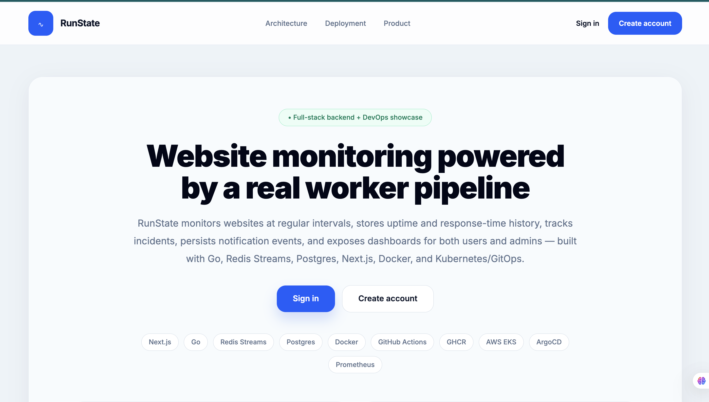
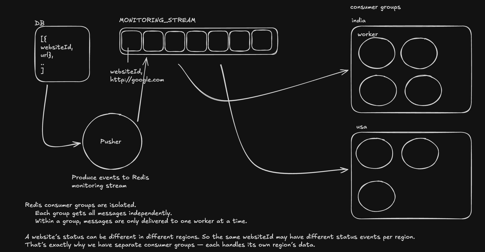
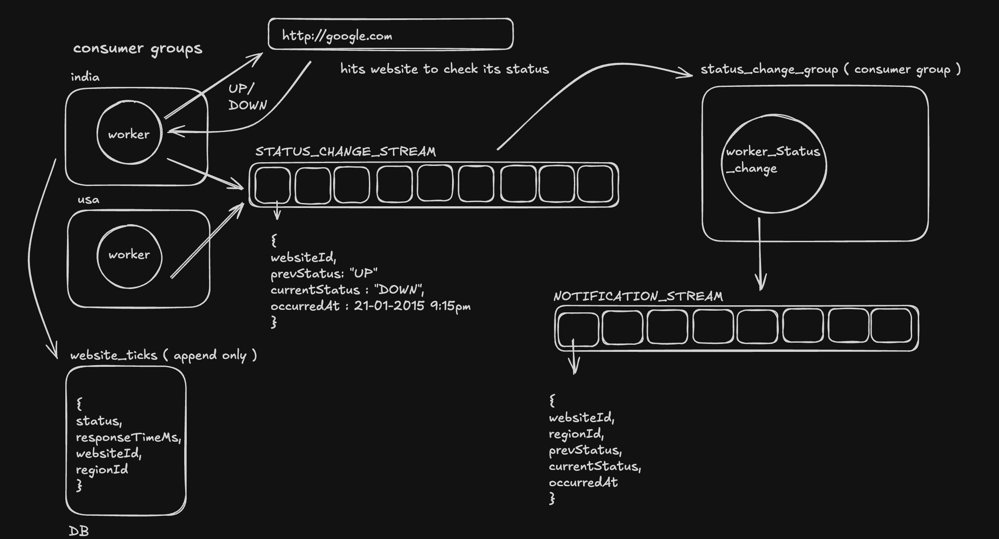
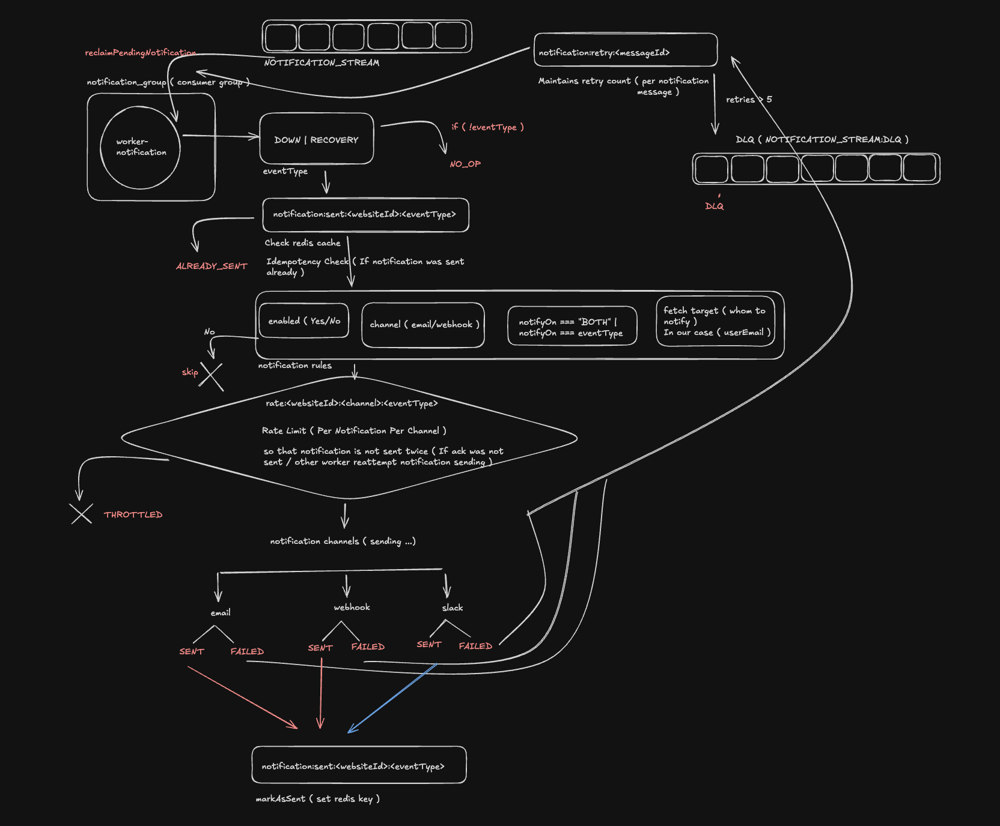
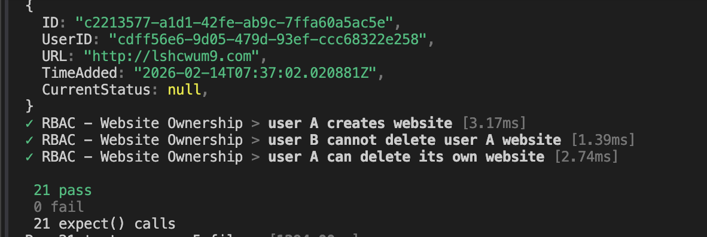

# RunState

**Production-style uptime monitoring platform inspired by BetterUptime — built with Go, Redis Streams, Postgres, Next.js, Docker, and Kubernetes/GitOps.**

## Demo

[](https://x.com/RitikaxG/status/2038948466790174967?s=20)

RunState monitors websites at regular intervals, stores uptime and response-time history, tracks incidents, persists notification events, and exposes a full frontend dashboard for both users and admins.





---

## What RunState does

RunState is an end-to-end website monitoring system with:

- periodic uptime checks
- response-time history tracking
- incident creation and resolution
- notification event logging
- authenticated user dashboard
- admin-only global monitoring views
- containerized local development
- Kubernetes deployment managed through GitOps

This project was first implemented and tested in TypeScript, then re-implemented in Go to deepen backend and systems design understanding through a real product build.

---

## Core highlights

- **Go backend** with layered architecture
- **Worker-based monitoring pipeline**
- **Redis Streams** for event-driven processing
- **Postgres persistence**
- **JWT + refresh-token authentication**
- **Prometheus metrics**
- **Next.js frontend** for users and admins
- **Dockerized multi-service setup**
- **GitHub Actions CI**
- **Kubernetes + GitOps deployment**

---

## Architecture

RunState is split into multiple components:

- **API server**  
  Handles authentication, website CRUD, admin endpoints, and frontend-facing APIs.

- **monitoring-pusher**  
  Periodically pushes websites into the monitoring pipeline.

- **worker-monitoring**  
  Executes website checks and stores uptime + response-time results.

- **worker-status-change**  
  Detects transitions such as `up -> down` and manages incident/status-change events.

- **worker-notification**  
  Persists notification history and processes alert events.

- **Redis**  
  Connects workers through event streams.

- **Postgres**  
  Stores users, websites, checks, response-time history, incidents, and notification logs.

- **Frontend (Next.js)**  
  Provides sign in/sign up, user dashboard, website detail pages, and admin views.

- **GitOps repo**  
  Kubernetes deployment state is managed in [`runstate-gitops`](https://github.com/RitikaxG/runstate-gitops).

---

## Frontend product views

### Sign in
Users and admins can log in through the same authentication flow.


### Sign up
New users can create an account and start adding websites to monitor.


### User dashboard
Each user gets a personal dashboard showing only their monitored websites, current status, latest response time, and last check time.


### Website status page
Each website has a detail page showing its current status, latest response time, recent checks, response-time chart, incidents, and notifications.


### Admin console
The admin console shows registered users, their roles, and the monitored websites visible across the system.


### Admin dashboard
The admin dashboard provides a global monitoring view across all users and all monitored websites.


---

## Key features

### Authentication
- Sign up and sign in flows
- JWT access tokens + refresh tokens
- Role-based access control for user/admin views

### Monitoring
- Add, list, and delete monitored websites
- Periodic background checks
- Website status tracking (`up`, `down`, `unknown`)
- Historical response-time storage

### Incident and alerting
- Incident tracking on status changes
- Incident resolution history
- Notification log persistence
- Background worker-based alert pipeline

### Frontend experience
- User dashboard with owned monitors
- Website detail pages with operational history
- Admin dashboard for global system visibility
- Admin console for user + role visibility
- Loading, empty, and error states
- Toast notifications

### Infra and ops
- Docker Compose for local stack
- Prometheus metrics exposure
- GitHub Actions CI
- Kubernetes-ready deployment flow via GitOps

---

## Repo structure

```txt
runState/
├── apps/
│   ├── api-go/        # Go backend, workers, migrations
│   ├── tests/         # Test suite
│   └── web/           # Next.js frontend
├── docs/
│   ├── architecture/  # Architecture diagrams
│   ├── devops/        # Deployment and infra notes
│   ├── workers/       # Worker flow documentation
│   └── images/        # README screenshots
├── packages/          # Shared monorepo packages
└── .github/workflows/ # CI workflows
```

---

## Local development

### 1. Start backend services

```bash
cd apps/api-go
go run ./cmd/server/main.go
```

### 2. Start workers

```bash
cd apps/api-go
go run ./cmd/monitoring-pusher/main.go
```

```bash
cd apps/api-go
go run ./cmd/worker-monitoring/main.go
```

```bash
cd apps/api-go
go run ./cmd/worker-status-change/main.go
```

```bash
cd apps/api-go
go run ./cmd/worker-notification/main.go
```

### 3. Start frontend

```bash
cd apps/web
npm install
npm run dev
```

### 4. Or run the stack with Docker

```bash
docker compose up --build
```

---

## Frontend environment variable

Create `apps/web/.env.local`:

```bash
NEXT_PUBLIC_API_BASE_URL=http://localhost:8080/api/v1
```

---

## Frontend implementation summary

The frontend is built with **Next.js App Router**, **TypeScript**, **Zustand**, and **Tailwind CSS**.

Key frontend areas:

- `app/` → routes and layouts
- `components/` → reusable UI pieces
- `stores/` → auth, websites, and UI state
- `lib/` → API client and helpers
- `types/` → DTO-aligned frontend types

---

## Proof of implementation

### Test suite

The repository includes tests under `apps/tests`, and the test suite has been executed successfully.



---

## Related repos

- **GitOps repo:** [runstate-gitops](https://github.com/RitikaxG/runstate-gitops)

---

## What I learned

RunState is the project through which I moved from building backend systems in TypeScript to re-implementing them in Go with stronger systems thinking.

Through this project, I learned and practiced:

- layered backend architecture in Go
- worker-based event processing
- Redis Streams coordination patterns
- Postgres persistence design
- incident and notification modeling
- frontend/backend contract design
- Docker-based local orchestration
- CI pipelines and container publishing
- Kubernetes + GitOps deployment flow

---

## Status

- Backend: **implemented**
- Frontend: **implemented**
- Worker pipeline: **implemented**
- Tests: **executed**
- Docker: **implemented**
- CI: **implemented**
- GitOps deployment: **implemented in separate repo**
