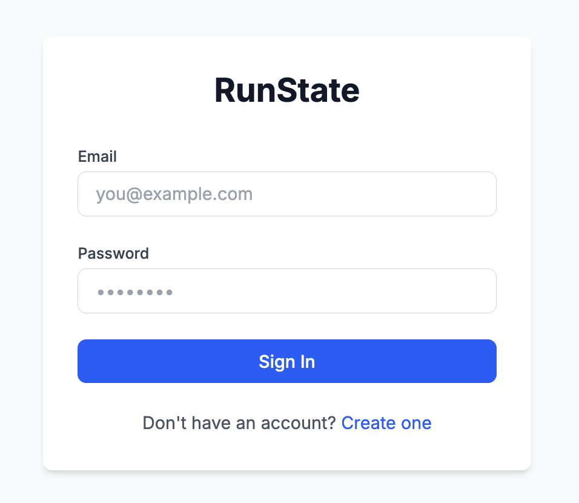
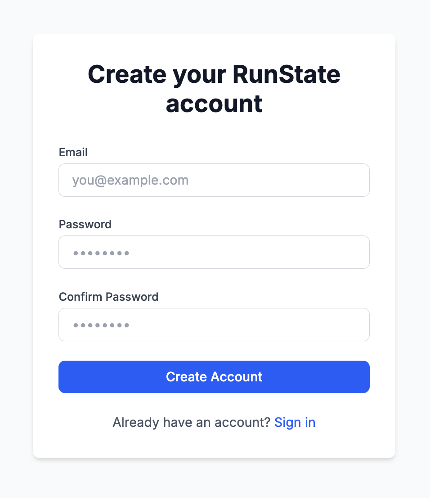
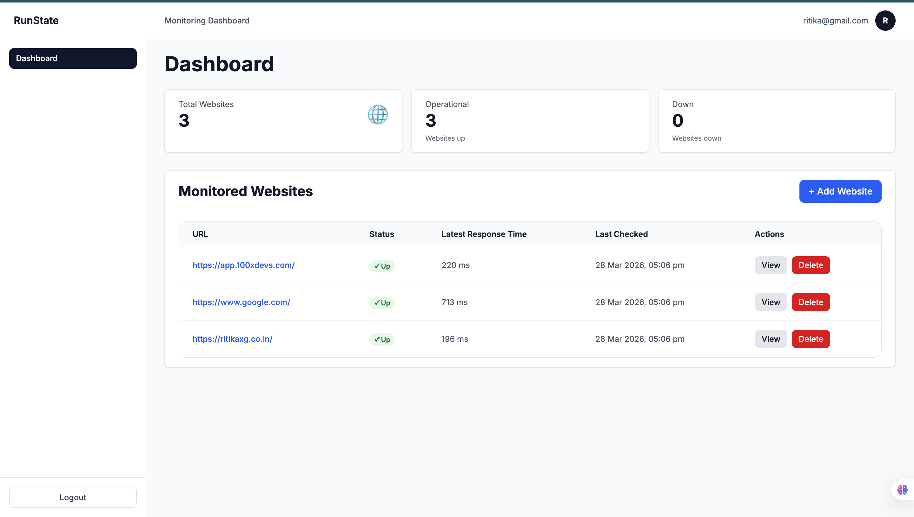
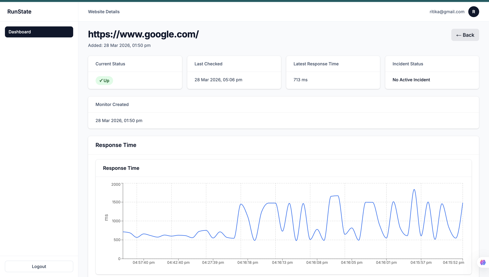
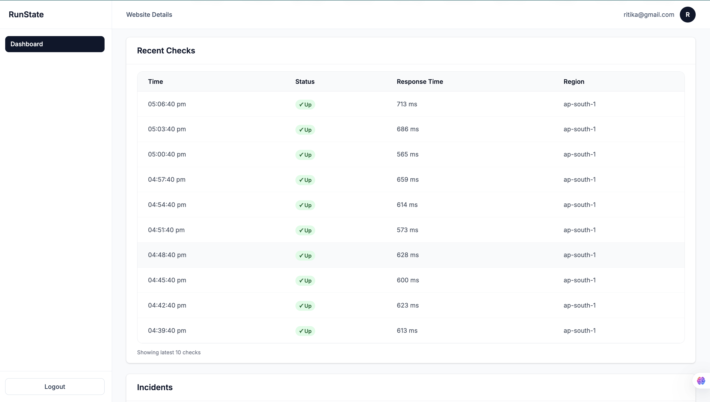
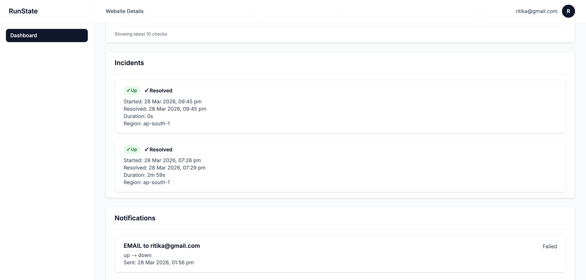
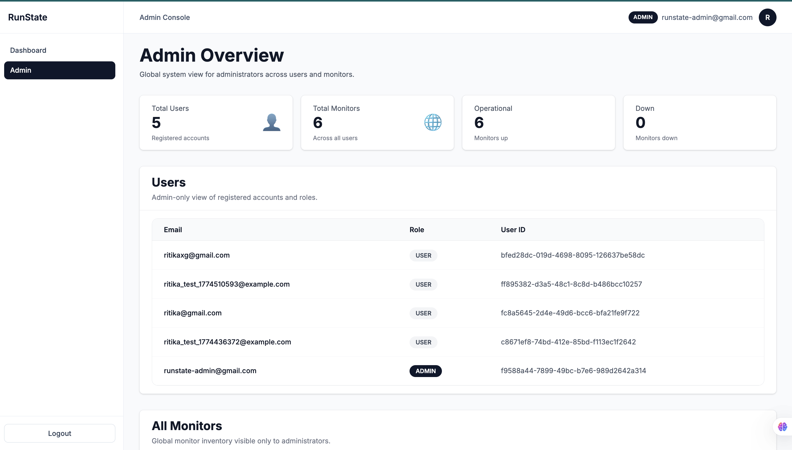
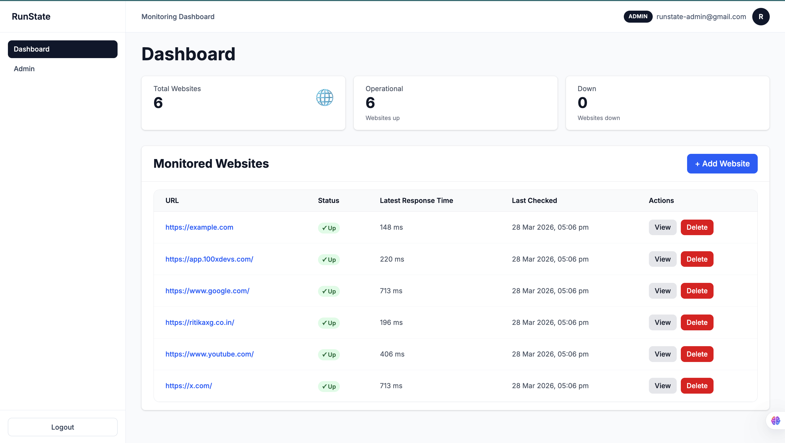

# RunState Frontend

Modern Next.js frontend for the RunState website monitoring platform.

## What it includes

- sign in / sign up flows
- user dashboard with personal monitored websites
- website detail pages with:
  - current status
  - recent checks
  - response-time chart
  - incidents
  - notification history
- admin dashboard with global website visibility
- admin console with registered users, roles, and monitored websites

---

## Setup

```bash
npm install
cp .env.local.example .env.local
npm run dev
```

Frontend runs on `http://localhost:3000`.

---

## Environment variable

```bash
NEXT_PUBLIC_API_BASE_URL=http://localhost:8080/api/v1
```

---

## Build

```bash
npm run build
npm start
```

---

## Directory structure

- **app/** - Next.js pages and layouts
- **components/** - reusable UI components
- **lib/** - API client, helpers, constants
- **stores/** - Zustand state management
- **types/** - shared TypeScript types
- **hooks/** - custom React hooks

---

## State management

Three Zustand stores power the frontend:

1. **auth-store** - authentication, user, tokens, hydration
2. **websites-store** - websites list and detail data
3. **ui-store** - modal, toast, and UI state

---

## API integration

- single API client in `lib/api.ts`
- typed request/response handling
- bearer token injection
- refresh-token based auth flow
- custom API error handling

---

## Styling

- Tailwind CSS
- reusable UI primitives
- responsive dashboard layout

---

## Feature views

### Sign in


### Sign up


### User dashboard


### Website details




### Admin console


### Admin dashboard

